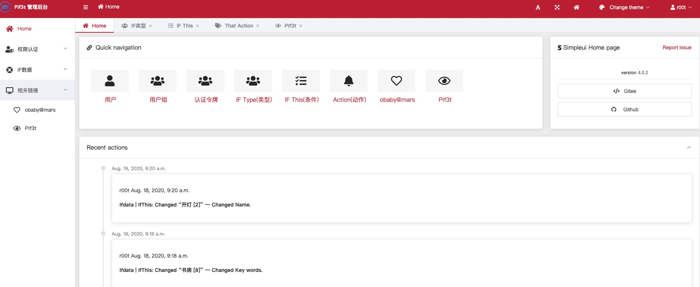
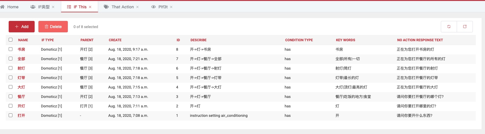
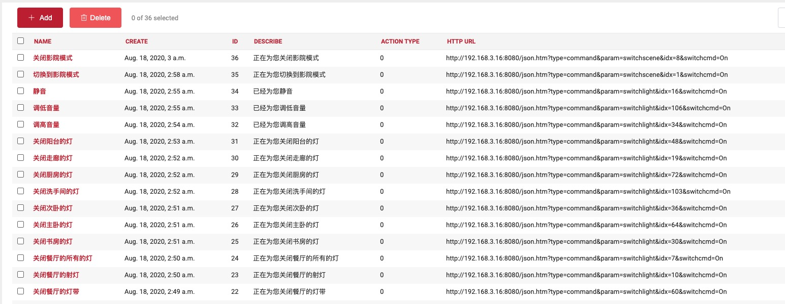

Pif3t 
======

Python if this then that
基于Django的ifttt系统，目前仅支持关键词匹配处理。

目的：  
> 1. 为了便于编写智能开关的控制流程逻辑， 告别硬编码
> 2. 便于随时修改相关的控制逻辑，增删命令关键词

截图：  
  
  

账号:  
> 管理员账号：r00t  
> 密码： wh04mi

相关链接：  
[blog:http://www.h4ck.org.cn](http://www.h4ck.rog.cn)  
[site:http://www.obaby.org.cn](http://www.obaby.org.cn)
